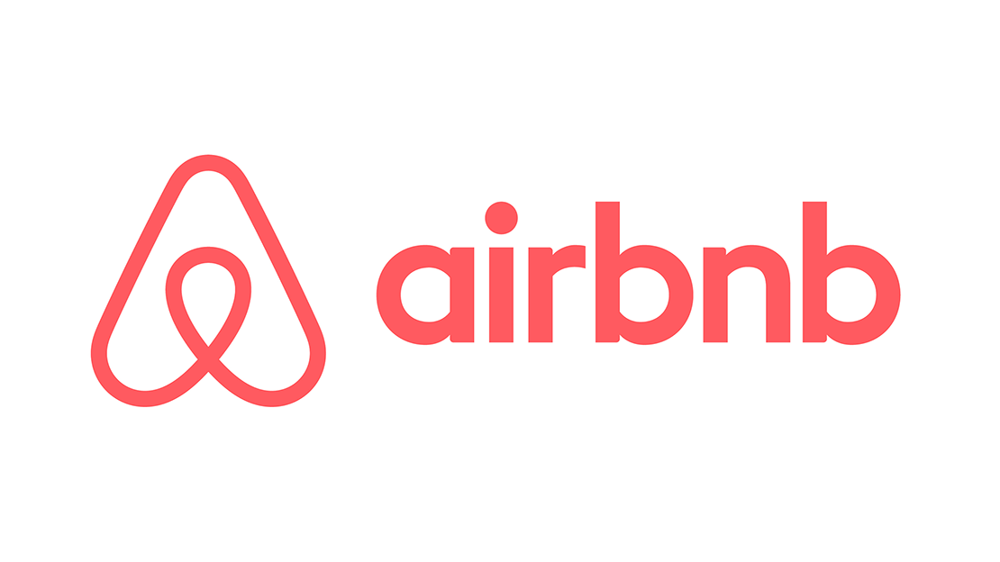
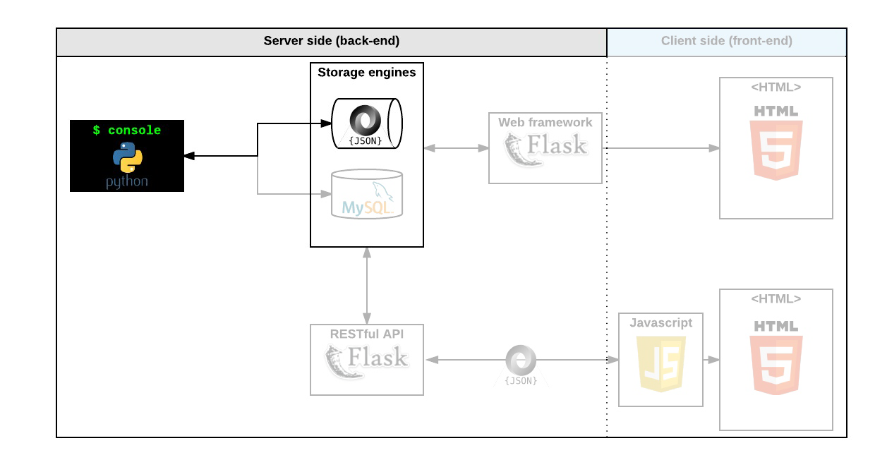

Diagram AirBnB clone (The Console)

And today will start with The Console (a command interpreter to manage your AirBnB objects).

This is the first step towards building your first full web application: the AirBnB clone. 

This first step is very important because you will use what you build during this project

with all other following projects: HTML/CSS templating, database storage, API, front-end integration and others.

Create The console (manage your AirBnB objects)

put in place a parent class (called BaseModel) to take care of the initialization, 
serialization and deserialization of your future instances

create a simple flow of serialization/deserialization: Instance <-> Dictionary <-> JSON string <-> file

create all classes used for AirBnB (User, State, City, Place...) that inherit from BaseModel

create the first abstracted storage engine of the project: File storage.

create all unittests to validate all our classes and storage engine

Installation:

$ git clone git@github.com:julius-ashley/AirBnB_clone.git
$ ./console.py

